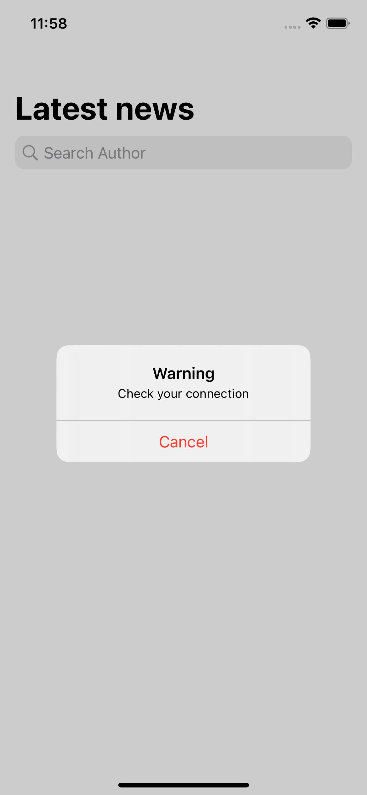
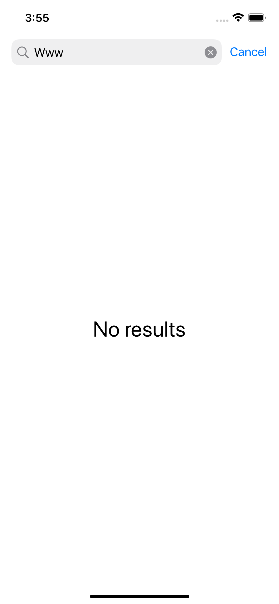

# News app
<b>Приложение показывает последние новости.</b>

Разделы README:

 - [Request](#request)
 - [Structure](#structure)
 - [Stack](#stack)

## Request ##
 
Для выполнения данного ТЗ, я использовал API  с сайта https://currentsapi.services/en.

 
<b>GET</b> /v1/latest-news

 
 [Network в файловой системе]
 
В случае отсутствия интернет соединения в течении 15 секунд, всплывает Alert и в последствии закрывается приложение: 

 
 
Если при скачивании и обработке данных, какой либо объект будет отсутствовать, в приложении используются стандартные объекты(напр. изображения). 

 
## Structure ##

Приложение состоит из 2 экранов Master и Detail. Основой обоих экранов является UIViewController.Оба экрана сверстаны с помощью кода (anchor), Storyboard и xib не использовался.

 - [Master](#master)
 - [Detail](#detail)

### Master ###
 
 [Master в файловой системе](https://github.com/focus61/News/tree/main/News/Master)
 
 
Главный экран показывает ленту последних новостей , с подгрузкой данных. На данный экран добавлено табличное представление, с кастомными ячейками.
 Для работы с получаемыми изображениями и добавлениями их в табличное представление был создан кастомный ImageView.
 
 [CustomImageView](https://github.com/focus61/News/blob/main/News/Master/CustomView/CustomImageView.swift)
 
Главный экран поддерживает поиск новостей по авторам:

  

  
  

### Detail ###

 [Detail в файловой системе](https://github.com/focus61/News/tree/main/News/Detail)

Детальный экран показывает подробности выбранной новости. Экран состоит из UIView и добавленных на него элементов.

 
 
 
 ## Stack ##
 - UINavigationController
 - UIViewController
 - UISearchController
 - UIAlertController
 - UIView & UILabel & UIImageView
 - UITableView & UITableViewCell
 - NSLayoutAnchor
 - GCD
 - URLSession
 - Timer
 
  [Network в файловой системе]:https://github.com/focus61/News/tree/main/News/NetworkService

 

