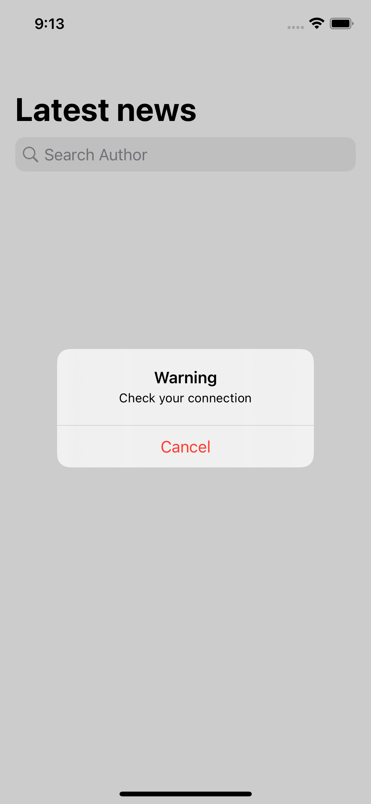

# News app
<b>Приложение показывает последние новости.</b>

Разделы README:

 - [Request](#request)
 - [Structure](#structure)

# Request #
 
 Для выполнения данного ТЗ, я использовал API  с сайта https://currentsapi.services/en.

 
<b>GET</b> /v1/latest-news

 
 Запрос и модель обработки получаемых данных находятся в папке: 

 
 [Network]
 
 В случае отсутствия интернет соединения в течении 15 секунд, всплывает Alert и в последствии закрывается приложение: 

 
 
 
# Structure #

 Приложение состоит из 2 экранов Master и Detail.

 - [Master](#master)
 - [Detail](#detail)

### Master ###
 
 
Главный экран показывает ленту последних новостей , с подгрузкой данных.

 
 Также главный экран поддерживает поиск новостей по авторам:

  
  
 
 В случае, если автор не найден: 

 
  

### Detail ###

Детальный экран показывает подробности указанной новости.

 

 
 
 
 [Network]:https://github.com/focus61/News/tree/main/News/News/Network
 

